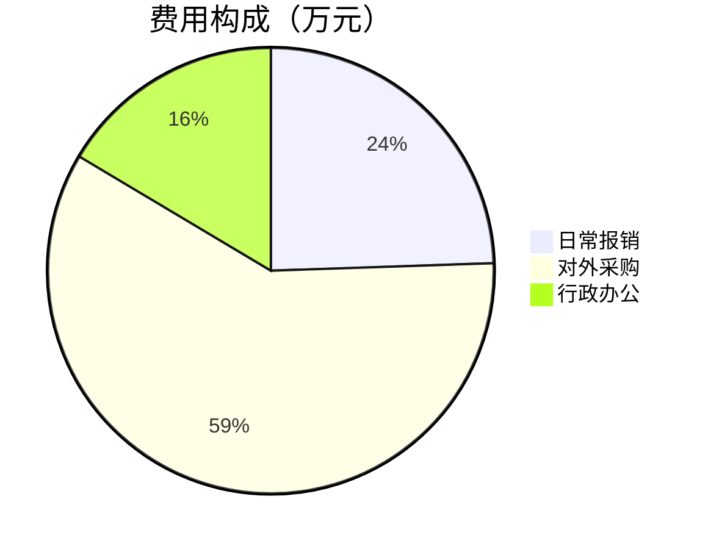

# 月度经营分析（中台接口优先）

## 使用前提

1. **确定目标月份**：从用户输入解析（如"9月"→ `2026-09`；拿不准先调 `get_current_time` 确认）。
2. **替换占位符**（下文所有 `{M}`/`{M_START}`/`{M_END}`/`{P_*}` 都要替换）：
   - `{M}` = `YYYY-MM`；`{M_START}` = 本月首日，`{M_END}` = 次月首日（如 `2026-09-01` / `2026-10-01`）
   - `{P_START}` / `{P_END}` = 上月区间；`{Y}` = 年份（如 `2026`）
3. **金额口径**：本币（含税）；接口返回自带 `formula/note` 字段时以其为准。

## 数据通道（优先级从高到低）

### A2. 中台月度经营接口（首选）

调用方式（二选一，视当前工具集）：
- 有 `erp_*` 命名工具：`erp_request(method="GET", path="<path>", params={...})`
- 无命名工具（经市场逐请求）：`market_execute(kind="mcp", capability="erp", tool="erp_request", params={"method":"GET","path":"<path>","params":{...}})`

**判成功**：返回体需满足 `success==true && returnCode==200`（外层 `success` 是 HTTP 层；中台业务错误会以 `returnCode=404/2100001` 返回）。不满足 → 按「降级规则」处理。

| # | 用途 | 方法/路径（经 erp_request） | 参数 | 关键返回字段 |
|---|------|------------------------------|------|--------------|
| 1 | 销售/采购/入出库**多月趋势** | GET `/statistics/business/trend` | `months=6` | `[{month, saleAmount, deliveryAmount, purchaseAmount, inboundAmount, outboundAmount}]` |
| 2 | 月发货量/金额 | GET `/statistics/delivery-monthly` | `month={M}` | `{deliveryQuantity, deliveryAmount}` |
| 3 | 客户 TOP | GET `/statistics/business/top-customers` | `start={M_START}`, `end={M_END}`, `limit=10` | `[{customerName, amount, quantity, ...}]` |
| 4 | 经营概览（区间） | GET `/statistics/business/overview` | `start={M_START}`, `end={M_END}` | `saleAmount/deliveryAmount/aftersaleDeliveryAmount/purchaseAmount/arrivalAmount/inboundAmount/outboundAmount/paymentAmount/saleOrderCount/completedDeliveryOrderCount` |
| 5 | **生产月度**（达成/良率） | GET `/statistics/business/production-monthly` | `month={M}`（可加 `dim=product`） | `planQuantity/completedQuantity/completionRate/goodQuantity/rejectQuantity/goodRate/rejectRate/workHours/byProduct[]` |
| 6 | **质量月度** | GET `/statistics/business/quality-monthly` | `month={M}` | `firstPassRate/rejectRate/goodQuantity/rejectQuantity/aftersaleCount/complaintCount/repairCount` |
| 7 | **齐套率月度** | GET `/statistics/business/kitting-rate` | `month={M}` | `planCount/kittedPlanCount/kittingRate/shortageRows/topShortageMaterials[]` |
| 8 | **财务收支月度** | GET `/statistics/business/cashflow-monthly` | `month={M}` | `receiveAmount/payAmount/netAmount/byCategory[]` |
| 9 | **费用月度** | GET `/statistics/business/expense-monthly` | `month={M}` | `totalAmount/byType[]` |
| 10 | **研发版本月度** | GET `/rd/statistics/version-monthly` | `month={M}` | `plannedCount/releasedCount/delayedCount/onTimeRate` |
| 11 | **认证月度** | GET `/rd/statistics/certification-monthly` | `month={M}` | `completedCount/inProgressCount/overdueCount/byProject[]` |
| 12 | **目标达成（OKR）** | GET `/oa/okr/statistics` | `period={M}`（可加 `dim=project\|product\|dept`） | `total/achieved/achievementRate/targetValue/actualValue/groups[]` |
| 13 | **年度目标（差距分析）** | GET `/oa/okr/targets` | `year={Y}` | 同 #12（年度口径） |
| 14 | 绩效月度 | GET `/oa/performance/statistics` | `period={M}` | `total/avgScore/gradeDistribution/deptDistribution` |
| 15 | 付款台账（按月） | POST `/finance/payment/query` | query `pageCurrent=1&pageSize=100`；body `{"startTime":"{M_START} 00:00:00","endTime":"{M_END} 00:00:00"}` | `records[]` + `total` |

### A. ERP 实时看板（生成时点口径，作补充）

`erp_statistics(kind=...)`：`overview` / `sales_revenue` / `fund_flow` / `inventory` / `product_delivery`（机型发货台数）/ `aftersale_delivery`。
> 这些接口无历史月份参数，是**生成时点**口径；报告中必须标注"ERP 实时看板（生成时点）"，不得冒充目标月数据。

### B. 数据库查询（兜底，仅 DB 查询工具可用时）

仅当 A2 对应接口"未就绪/异常"且当前有数据库只读查询工具（execute_query 类）时执行；报错一次即放弃并转缺口标注。

**销售汇总（本月+上月）**
```sql
SELECT '本月' AS period, COUNT(DISTINCT s.code) AS order_cnt,
       COUNT(DISTINCT s.customer_code) AS cust_cnt,
       ROUND(SUM(om.material_quantity*om.purchase_price*om.exch_rate),2) AS amount_cny
FROM tb_erp_sale s JOIN tb_erp_order_material om ON s.code=om.order_code
WHERE s.create_time >= '{M_START}' AND s.create_time < '{M_END}'
UNION ALL
SELECT '上月', COUNT(DISTINCT s.code), COUNT(DISTINCT s.customer_code),
       ROUND(SUM(om.material_quantity*om.purchase_price*om.exch_rate),2)
FROM tb_erp_sale s JOIN tb_erp_order_material om ON s.code=om.order_code
WHERE s.create_time >= '{P_START}' AND s.create_time < '{P_END}'
```

**采购汇总（本月+上月）**
```sql
SELECT DATE_FORMAT(p.create_time,'%Y-%m') AS ym, COUNT(DISTINCT p.code) AS purchase_cnt,
       ROUND(SUM(pm.material_quantity*pm.purchase_price*pm.exch_rate),2) AS amount_cny
FROM tb_erp_purchase p LEFT JOIN tb_erp_order_material pm ON p.code=pm.order_code
WHERE p.create_time >= '{P_START}' AND p.create_time < '{M_END}'
GROUP BY DATE_FORMAT(p.create_time,'%Y-%m')
```

**库存概况（当前时点）**
```sql
SELECT SUM(rm.quantity) AS total_qty, SUM(rm.quantity*rm.price) AS stock_value,
       COUNT(DISTINCT rm.material_code) AS sku_cnt
FROM tb_erp_repository_material rm WHERE rm.quantity > 0
```

**售后/借货/到货计数（本月）**
```sql
SELECT
  (SELECT COUNT(*) FROM tb_erp_aftersale WHERE create_time >= '{M_START}' AND create_time < '{M_END}') AS aftersale_cnt,
  (SELECT COUNT(*) FROM tb_erp_borrow   WHERE create_time >= '{M_START}' AND create_time < '{M_END}') AS borrow_cnt,
  (SELECT COUNT(DISTINCT code) FROM tb_erp_arrival WHERE create_time >= '{M_START}' AND create_time < '{M_END}') AS arrival_cnt
```

## 执行方式（严格，最多 3 轮）

- **第 1 轮**：一次性**并行**发起 **A2 全部 15 条 + A 组 6 条**（共 21 条），不逐条确认、不先探索其他表。
- **第 2 轮**：失败项只修正一次（参数名 / 日期格式 / POST body）；若多台 A2 接口返回 `404 / 2100001 / 500`（未就绪），对应项改为执行 B 组 SQL（DB 工具可用时），否则标记缺口。
- **第 3 轮**：按「报告模板」撰写完整报告并输出，**不再新增任何查询**。默认直接输出；仅当用户明确要求保存文件时，写入 `.agent/report/`。

## 降级与缺口规则（重要）

1. 每一项按 **A2 → B（SQL）→ 缺口** 顺序取数；前一层不成功才用下一层。
2. 缺口标注格式：`【数据缺口·<原因>】`，原因写清（如"中台接口未就绪(404)"、"该指标无数据源(制造费用率)"、"目标尚未录入"）。
3. **禁止编造任何数字**；口径存疑必须标注（如币种异常、数据截止时间）。
4. 报告末尾附「数据来源与缺口」小节，列明每部分实际来源（中台月度接口 / ERP 时点看板 / 数据库 / 缺口）。

## 图表与输出形态（对话版 / 邮件版）

报告**默认输出 Markdown（对话版，含 Mermaid 图表）**；当用户提到"发邮件 / 给领导 / HTML 版"时，改输出 **email-safe HTML（邮件版）** 并可代为发送。

### 对话版图表（Mermaid，选 2~4 张；仅用已取到的数据，缺失不画）

**趋势图（销售/采购，多月）**——数据来自 #1；数值不带千分位：
````markdown
```mermaid
xychart-beta
    title "销售金额趋势（万元）"
    x-axis [2月, 3月, 4月, 5月, 6月, 7月, 8月, 9月]
    y-axis "万元" 0 --> 3000
    bar [780, 1186, 2381, 863, 2765, 536, 1269, 2960]
    line [780, 1186, 2381, 863, 2765, 536, 1269, 2960]
```
````

**客户 TOP5（条形）**——数据来自 #3：
````markdown
```mermaid
xychart-beta
    title "客户 TOP5（万元）"
    x-axis [客户A, 客户B, 客户C, 客户D, 客户E]
    y-axis "万元" 0 --> 1500
    bar [1402, 345, 305, 213, 110]
```
````

**费用构成（饼图）**——数据来自 #9：
````markdown

````

规则：x 轴标签 ≤6 字（客户名取简称）；每张图后仍保留数据表；图表渲染失败不影响报告（表格兜底）。

### 邮件版（email-safe HTML）

**硬性要求**：只用 `div/table/tr/td/p/h2/h3/ul/li/span/b` + **内联 style**；**禁止** Mermaid、`<style>`、flex/grid、SVG、外链图片/字体；条形图用「嵌套 table 色条」按最大值归一化宽度；每个条形**旁边必须给数字**（纯文本客户端也可读）。

模板骨架（按章节填充；指标卡一排 3~4 个）：
```html
<div style="font-family:'Microsoft YaHei',Arial,sans-serif;color:#1f2329;font-size:14px;line-height:1.7;max-width:760px">
  <h2 style="margin:0 0 6px">霞智科技 {Y}年{M}月经营分析</h2>
  <p style="color:#8f959e;font-size:12px;margin:0 0 14px">数据来源：中台月度接口 + ERP 实时看板（生成时点）；金额为含税本币</p>

  <h3 style="margin:16px 0 8px;border-left:3px solid #2f6bff;padding-left:8px">一、核心指标</h3>
  <table style="border-collapse:collapse;width:100%"><tr>
    <td style="width:25%;padding:10px;background:#f5f7fa;text-align:center;border:1px solid #e5e7eb">
      <div style="color:#8f959e;font-size:12px">销售金额</div>
      <div style="font-size:20px;font-weight:700">2,959.6万</div>
      <div style="font-size:12px;color:#e5484d">环比 +133.2%</div>
    </td>
    <!-- 同排再放 2~3 个指标卡（发货/齐套率/净现金流…） -->
  </tr></table>

  <h3 style="margin:16px 0 8px;border-left:3px solid #2f6bff;padding-left:8px">二、销售趋势（万元）</h3>
  <table style="border-collapse:collapse;width:100%;font-size:12px">
    <tr><td style="width:52px;color:#646a73">9月</td>
      <td><table style="border-collapse:collapse;width:100%"><tr><td style="width:100%;height:14px;background:#2f6bff;border-radius:2px"></td><td style="width:0"></td></tr></table></td>
      <td style="width:88px;text-align:right;font-weight:600">2,959.6万</td></tr>
    <!-- 其余月份同理；宽度% = 数值/最大值 -->
  </table>
  <p style="color:#8f959e;font-size:12px;margin:4px 0">条形长度按区间最大值归一化</p>

  <!-- 各章节数据表（同 Markdown 版内容，改为 HTML table + 内联样式） -->
  <h3 style="margin:16px 0 8px;border-left:3px solid #2f6bff;padding-left:8px">附录：数据缺口</h3>
  <ul><li>…</li></ul>
</div>
```

**发送规则**：收件人先与用户确认（未给明确收件人不得擅自发送）；调用
`send_email(to=["xxx@xzrobot.com"], cc=[...], subject="霞智科技 {M}月经营分析", body=<上面的HTML>, is_html=True)`；
发送后回报结果（成功/失败原因）。

**界面直出 HTML**：对话回复中直接输出该 HTML 时，网页端/桌面端会**安全渲染**（表格与条形图可见）；钉钉等纯文本渠道会把 HTML 显示为源码——**从钉钉使用时改用对话版 Markdown + Mermaid**。

## 报告模板（两大部分）

```markdown
# 霞智科技 YYYY年M月经营分析

> 数据来源：中台月度经营接口（{M}）+ ERP 实时看板（生成时点）+（必要时）业务库查询
> 口径说明：金额含税本币；中台接口为自然月口径；ERP 看板为生成时点口径

## 第一部分 上月数据统计

### 1. 销售（定 / 发 / 收）
| 指标 | 本月 | 上月/环比 | 来源 |
|------|------|----------|------|
| 销售金额 / 订单数 | #4/#1 | #1 环比 | 中台 |
| 发货量 / 发货金额 | #2 | — | 中台 |
| 发货台数（机型结构） | A.product_delivery | — | ERP 时点 |
| 收款 / 付款 / 净额 | #8（#15 明细） | — | 中台 |
- 客户 TOP10（#3）、多月趋势要点（#1）、数据质量提示（币种/未建档等）

### 2. 供应链
- **生产效率/达成率/良率**：#5（计划/完工/达成率/goodRate/rejectRate/工时）
- **发货台数**：A.product_delivery（时点）+ #2（月）
- **库存数据**：A.inventory（时点）+ B.库存 SQL（金额/SKU）
- **齐套率**：#7（齐套率/缺料行数/TOP 缺料）
- **制造费用率**：【数据缺口·该指标暂无数据源（待财务口径）】

### 3. 研发
- **版本情况**：#10（计划/发布/延期/按期率）；无数据时标注【版本数据尚未录入】
- **认证进展**：#11（完成/进行中/逾期/按项目）；同上
- **研发目标达成**：#12（dim=project|product）

### 4. 质量
- **质量关键指标**：#6（一次合格率/不良率）
- **售后情况**：#6（售后/客诉/返修）+ A.aftersale_delivery（时点）

### 5. 财务收支
| 指标 | 本月 | 来源 |
|------|------|------|
| 收款 / 付款 / 净额 | #8 | 中台 |
| 费用构成（按类别） | #9 | 中台 |
| 资金看板（时点） | A.fund_flow | ERP 时点 |

## 第二部分 经营情况分析和建议

### 1. 销售业绩与目标差距
- 与年初目标差距：#13（year={Y}）+ #12（当月进度）+ #1 销售实绩
- 数据未录入时：#13/#12 返回空 → 标注【目标尚未录入】，仅按实绩给冲刺建议
- 冲刺计划：重点客户/停滞订单/回款（3~5 条，数据支撑）

### 2. 供应链 / 研发 / 质量建议
- 各域 1~3 条（基于 #5/#7、#10/#11、#6 的量化结果）

### 3. 财务费用管控建议
- 基于 #9 费用分类 + #8 收支缺口：2~4 条

## 附录：数据来源与缺口
- 各节实际来源与缺口清单（含未就绪接口/未录入数据/无数据源指标）
```

- **图表（对话版）**：在「1. 销售」后放销售/采购趋势图 + 客户 TOP5 条形图；「5. 财务收支」后放费用构成饼图；「供应链」齐套率/达成率可放条形图。数据缺失则不画。
- **默认直接输出完整报告内容**，不要写文件。
- 仅当用户明确要求"保存/生成报告文件"时，才写入 `.agent/report/` 目录。

## 红线

- **只读**：ERP/中台接口禁止 PUT/DELETE/创建类；SQL 只允许 SELECT。
- **只执行 A2 组 15 + A 组 6**（第 2 轮最多补 B 组 4 条），不要 describe 其他表、不要重复或追加查询。
- 接口未就绪、数据未录入、无数据源 → **一律标注缺口，禁止编造或强行估算**。
- SQL 报错（列名 / `only_full_group_by`）修正一次即停。
